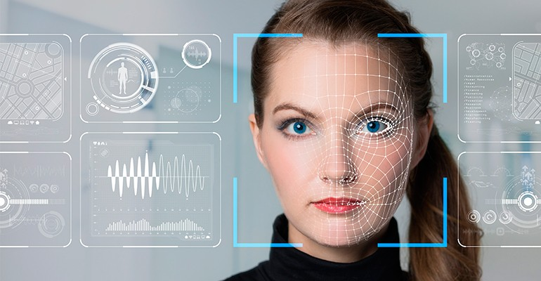
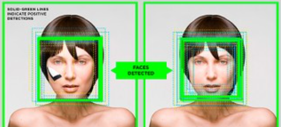

<body>
    <h1>Reconhecimento Facial</h1>
    
    
Este repositório contém um sistema de reconhecimento facial que detecta e reconhece rostos em imagens.

    <h2>Instalação</h2>
    <ol>
        <li>Clone este repositório:</li>
        <pre><code>git clone https://github.com/GiooEsteves/reconhecimento_Facial.git</code></pre>
        <li>Instale as dependências:</li>
        <pre><code>pip install opencv-python</code></pre>
    </ol>
    <h2>Uso</h2>
    
Há 3 softwares de reconhecimento, que possuem diferentes métodos, que podem ser usado.

    
Para utilizar o sistema de reconhecimento facial do método Eigenfaces, execute o seguinte comando:

    <pre><code>python reconhecedor_eigenfaces.py</code></pre>
    
Para utilizar o sistema de reconhecimento facial do método Fisherfaces, execute o seguinte comando:

    <pre><code>python reconhecedor_fisherfaces.py</code></pre>
    
Para utilizar o sistema de reconhecimento facial do método LBPH, execute o seguinte comando:

    <pre><code>python reconhecedor_LBPH.py</code></pre>
    <h2>Funcionalidades</h2>
    <ul>
        <li>Detecção de rostos em imagens.</li>
        <li>Reconhecimento facial de pessoas específicas.</li>
        <li>Identificação de expressões faciais.</li>
    </ul>
    <h2>Exemplos</h2>
    <h3>Entrada:</h3>
    
    <h3>Saída:</h3>
    
    <h2>Créditos</h2>
    
Este projeto foi desenvolvido por <a href="https://github.com/GiooEsteves">Giovanna Valentina Esteves</a>.

</a>

</body>
</html>
